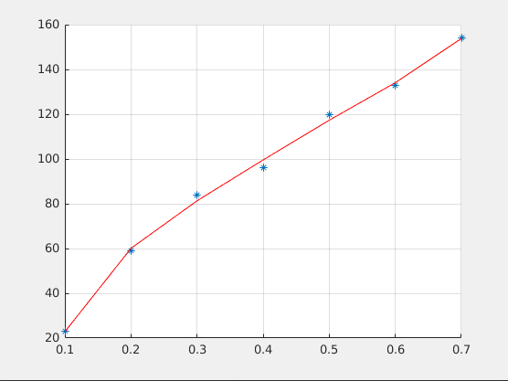

### 1.1	Реализовать в matlab метод МНК (https://ru.wikipedia.org/wiki/Метод_наименьших_квадратов) для конечного набора значений, используя полином 5 степени, без использования стандартных функций lsqcurvefit() или polyfit(). На графике должны отображаться заданные точки и аппроксимирующая их функция. Приложить скриншоты графиков.

x = [0.1; 0.2; 0.3; 0.4; 0.5; 0.6; 0.7];

y = [23; 59; 84; 96; 120; 133; 154];

